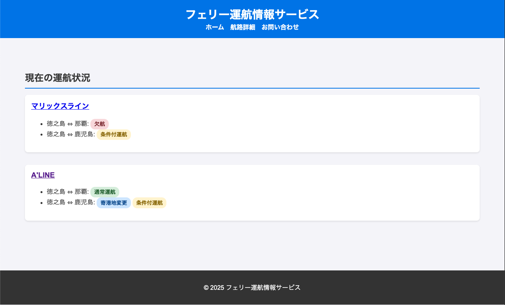

# ShipInfo

[](https://github.com/yanchi/ShipInfo/actions/workflows/ci.yml)

A backend service that scrapes ferry company websites to collect, store, and notify on operational status (cancellations, delays, normal operations).

**Python (scraper) + Symfony/PHP (web app) + MySQL** — 3-tier architecture integrated with Docker Compose.

---

## Demo



Home screen. Displays route-level operational status (normal / cancelled / conditional, etc.) across multiple ferry companies in a single view.

---

## Architecture

```
[Ferry Company Website]
       ↓ HTTP scraping (BeautifulSoup)
[Python Scraper]
       ↓ INSERT … ON DUPLICATE KEY UPDATE
[MySQL 8.0]
       ↑ Doctrine ORM
[Symfony 7.2 Web App]
       ↓ Twig templates
[Browser]

Abnormal status detected → SMTP email alert
```

---

## Data Model

```
Company (ferry operator)
  └── Route (e.g. Tokunoshima ⇔ Kagoshima)
        └── Operation (daily status: normal / delayed / cancelled / conditional ...)
```

- **Company** — Ferry operator (Marix Line, A'LINE, etc.)
- **Route** — Each operator's routes, including direction (inbound/outbound)
- **Operation** — Daily operational status. `status` / `status_text` stored as JSON arrays to support multiple concurrent statuses

---

## Problem / Solution

### Problem

- Each ferry company has a different website structure, making it difficult to check statuses across multiple operators at once
- Abnormal statuses like cancellations and delays are easy to miss
- Official sites are not designed for quick status checks and lack a consolidated view

### Solution

- Scrape each company's site and store data in MySQL using a common schema
- Provide a unified UI via Symfony to compare multiple companies on a single screen
- Send email alerts when abnormal statuses are detected

### Design Intent

More than a simple display app — this is a backend-oriented service covering the full pipeline: **collect → store → display → notify**.
Designed with production use in mind, emphasizing idempotency, configuration management, testability, and real-DB integration testing.

---

## Tech Stack

| Layer | Technology |
|---|---|
| Scraping | Python 3.12 / requests / BeautifulSoup4 |
| Backend | PHP 8.2 / Symfony 7.2 / Doctrine ORM |
| DB | MySQL 8.0 |
| Infrastructure | Docker / Docker Compose |
| Testing | PHPUnit 9 (integration) / pytest (44 tests) |
| CI | GitHub Actions |

---

## Testing

```bash
# PHP (integration tests: 11)
cd ship_info && php bin/phpunit

# Python (unit tests: 44)
cd python && python -m pytest tests/ -v
```

Runs automatically on `push` / `pull_request` via GitHub Actions. A MySQL service container is spun up in CI and migrations are applied before tests run against the real DB.

---

## Design Highlights

### 1. Idempotent data collection via upsert

Uses `INSERT … ON DUPLICATE KEY UPDATE` so re-running the scraper never creates duplicate records.
Combined with a DB-level unique constraint `(route_id, operation_date)` to guarantee consistency.

```python
# python/src/db.py
cursor.execute("""
    INSERT INTO operations (route_id, operation_date, status, ...)
    VALUES (%s, %s, %s, ...)
    ON DUPLICATE KEY UPDATE status = VALUES(status), updated_at = VALUES(updated_at)
""", ...)
```

### 2. Email alerts on abnormal status detection

Detects non-normal statuses (cancellations, delays) at scrape time and sends an SMTP alert.
Gracefully skips notification if `SMTP_HOST` is not configured — logs a warning instead of crashing.

```python
# python/src/notifier.py
def send_alert(abnormal_entries: list[dict]) -> None:
    if not abnormal_entries:
        return
    # Skip gracefully if env vars are not set
    if not smtp_host or not notify_to:
        logging.warning("...")
        return
    ...
```

### 3. Testability via `ClockInterface` injection

The "today's operations" controller injects PSR's `ClockInterface` instead of calling `new \DateTime('now')` directly.
This allows tests to substitute any date without mocking the system clock.

```php
// ship_info/src/Controller/DetailsController.php
public function __construct(
    private readonly ClockInterface $clock,
    #[Autowire(param: 'app.company_urls')] private readonly array $companyUrls,
) {}

// In tests, inject a mock clock
$mockClock->method('now')->willReturn(new \DateTimeImmutable('2025-02-12'));
```

### 4. Centralized configuration via Symfony parameters

Ferry company URLs are not hardcoded in controllers — they are defined in `services.yaml` under `parameters` and injected type-safely via `#[Autowire(param: '...')]`.

```yaml
# ship_info/config/services.yaml
parameters:
    app.company_urls:
        マリックスライン: 'https://marixline.com/'
        "A'LINE": 'https://www.aline-ferry.com/'
```

### 5. Integration tests against a real DB

Avoids mocking the database. Tests run against a dedicated test DB (`ship_info_test`) with actual data inserts and assertions.
`WebTestCase`-based integration tests cover the full path from HTTP request to rendered response.

```php
// ship_info/tests/IntegrationTestCase.php
abstract class IntegrationTestCase extends WebTestCase
{
    protected function cleanupEntity(EntityManagerInterface $em, string $class, int $id): void
    protected function mockClock(string $date): void
}
```

---

## Local Setup

```bash
# 1. Start containers
docker-compose up -d

# 2. Run migrations
docker-compose exec symfony php bin/console doctrine:migrations:migrate --no-interaction

# 3. Run scraper
docker-compose exec python python save_kametoku_info.py
```

| URL | Description |
|---|---|
| http://localhost:8080 | Latest operational status per route |
| http://localhost:8080/details/today | Today's departures (sorted by time) |
| http://localhost:8080/contact | Contact form |

### Environment Variables (`.env`)

```env
APP_ENV=dev
DATABASE_URL=mysql://user:password@db:3306/ship_info
MARIXLINE_SERVICE_URL=https://marixline.com/service/
# Email alerts (optional)
SMTP_HOST=smtp.example.com
SMTP_PORT=587
SMTP_USER=your@example.com
SMTP_PASSWORD=secret
NOTIFY_FROM=your@example.com
NOTIFY_TO=alert@example.com
```

---

## Production Deploy

See [config/deploy/README.md](config/deploy/README.md) for the full VPS deployment guide (Rocky Linux + Docker + Nginx + Let's Encrypt).

```bash
# Update deploy (git pull → rebuild → migrate)
bash /home/rocky/ShipInfo/deploy.sh
```

---

## Future Work

- PHP enum for `Operation.status` ([#14](https://github.com/yanchi/ShipInfo/issues/14))
- Support for additional ferry operators
